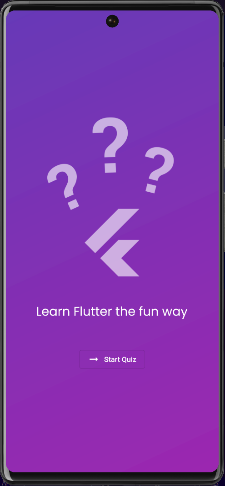
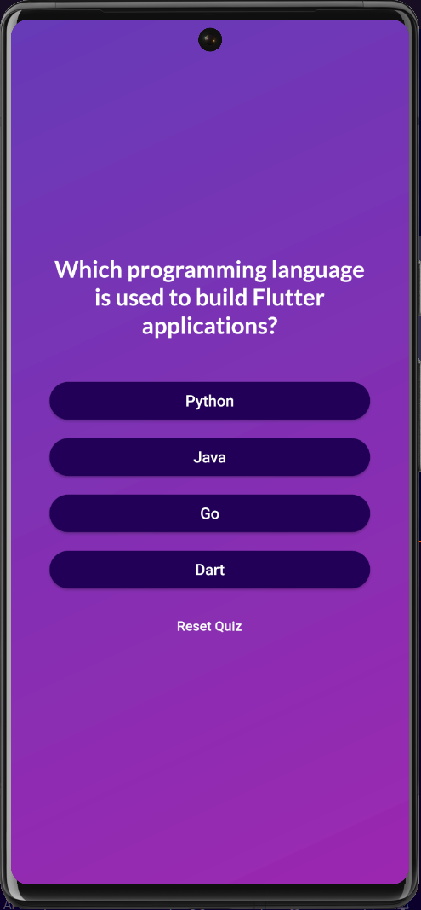
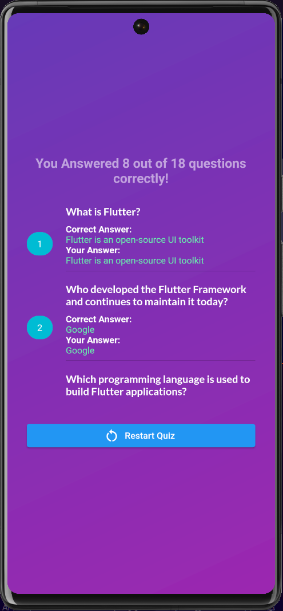

# Flutter Quiz App

This is a simple quiz app made with Flutter and Dart. It is a hybrid app that can be run on both Android and iOS devices.

However, It can also be run on Web Browsers and Desktops i.e. MacOS, Windows, Linux from the Flutter Version 3.3.

## Table of Contents

- [About](#about)
- [Getting Started](#getting_started)
- [Prerequisites](#prerequisites)
- [Installing](#installing)
- [Screenshots](#screenshots)

## <a id = "about">About</a>

It is a simple quiz app with 18 questions. The questions are stored in a list of maps. The questions are displayed one by one and the user can select the answer by clicking on the option. The user can also go back to the previous question and change the answer. The user can also restart the quiz by clicking on the restart button. The user can also see the score at the end of the quiz.

## <a id="getting_started">Getting Started</a>

This project is a Hybrid App made with Flutter and Dart. It is a simple quiz app with 18 questions.

### <a id="prerequisites">Prerequisites</a>

You need to have Flutter installed on your system. If you don't have Flutter installed on your system, you can follow the steps given in the official documentation of Flutter to install Flutter on your system.

### <a id="installing">Installing</a>

You can clone the repository on your system using the following command:

```
git clone
```

## <a id = "screenshots">Screenshots</a>




